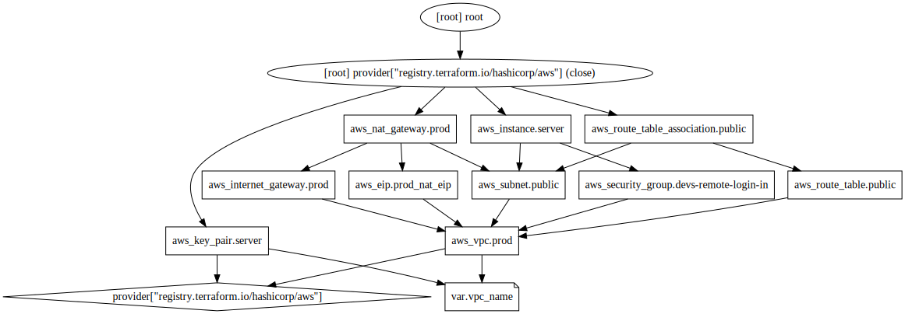
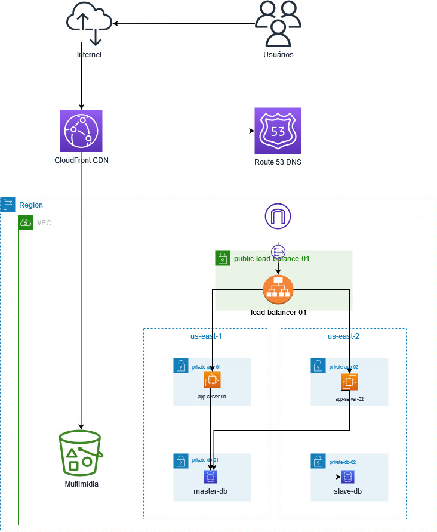

# Portal Covid-19

## A solução é satisfatória? Em quais aspectos?

Para fazer uma análise visual dos recursos construídos em nuvem pelo Terraform, 
podemos gerar um arquivo no formato DOT e converter para o formato svg conforme
o comando abaixo:

```bash
terraform graph | dot -Tsvg > graph.svg
```

Com esse comando obtemos a seguinte iremos obter a seguinte imagem em nosso
diretório raiz do terraform:



A partir da análise do grafos gerado pelo terraform podemos ver que trata-se de uma 
arquitetura monolítica centralizada em uma rede vpc onde temos apenas um servidor 
fazendo uso desses recursos escalonados em nuvem. Também podemos inferir que a 
arquitetura de software a ser utilizada pela aplicação também é monolítica, visto que
não há provisionamento de instâncias de bancos de dados, nem armazenamento de arquivos
em nuvem.

Diante dessa estrutura podemos afirmar que a estrutura atual não possui os requisitos
necessários de escalabilidade para poder atender as demandas do projeto.


## Quais perguntas a mais você faria?

Afim de provisionar uma estrutura de que esteja de acordo com as demandas de projeto
faria as seguintes perguntas aos desenvolvedores:

* Quais são as portas de acesso a vm que vocês realmente precisam para poder manipular
os artefatos dentro dos servidores de aplicações?
* Qual é o banco de dados a ser utilizado?
* Quais os tipos de arquivos estáticos que serão manipulados pela aplicação?
* Como é feita a configuração da aplicação em ambiente de produção?
* Existe a possibilidade de criar uma imagem docker da aplicação para deploy em nuvem?

## O que você propõe de melhoria?

Afim de extrair o melhor uso do ambiente em núvem para o deploy de aplicações de alta disponibilidade
sem que haja uma completa ruptura da arquitetura aplicada no projeto, recomendo uma arquitetura de 3 tiers
afim de separar a camada de aplicação da camada de dados, dessa forma teríamos uma instância de banco de dados
(redundante, por meio da configuração master e slave, em regiões diferentes) separadas das instâncias
de aplicações.

Como disponíbilidade e redundância são fatores chaves para garantir o sucesso do projeto, é importante que
tenhamos nossa estrutura disponível em pelo menos 2 regiões e que haja um balanceamento de carga para garantir
que mesmo que uma das regiões fique indisponível teremos ao menos outra região ainda em funcionamento garantindo
a disponibilidade da aplicação ao usuário final. Existe ainda a possiblidade de adicionar o escalonamento automático
das instâncias de aplicação afim e atender picos de acessos, sendo necessário apenas criar uma imagem do servidor
de aplicação para ser replicado de maneira automática pelo gerenciador de escalonamento, mediante a regras
previamente estabelecidas, eliminando a necessidade dos desenvolvedores provisionarem novas instâncias de forma manual.

Podemos conferir uma ideia geral da estrutura recomendada a partir da seguinte imagem:



Adicionalmente a estrutura recomendada anteriormente, podemos notar os seguintes serviços adicionais:

- **CloudFront:** Serviço de Content Delivery Network (CDN), serviço de cache de conteúdo estático ao usuário final
baseado na localização do usuário, com isso melhoramos significativamente o tempo de resposta da aplicação
ao usuário final.
- **Route 53:** Serviço de Domain Name Server (DNS), retorna de maneira muito mais rápida e eficiente o IP do balanceador 
de carga e maior controle dos tipos de requisições que chegam ao balanceador de carga.
- **Bucket S3**: Serviço de armazenamento de arquivos, em conjunto do CloudFront temos a entrega mais rápida de recursos estáticos
assim como também removemos da camada de aplicação e da camada de banco de dados arquivos estáticos, tornando a camada de aplicação
altamente replicável e escalonável.

Apesar de existir diversas melhorias que podem ser feita a partir de um maior entendimento das regras de negócio assim como também
da arquitetura da aplicação, creio que esta é uma arquitetura bem simples, de fácil reprodutibilidade, fácil gerenciamento e segura
com a qual desde o primeiro momento podemos ter uma estrutura funcional e que faz uso das vantagens da arquitetura em nuvem.